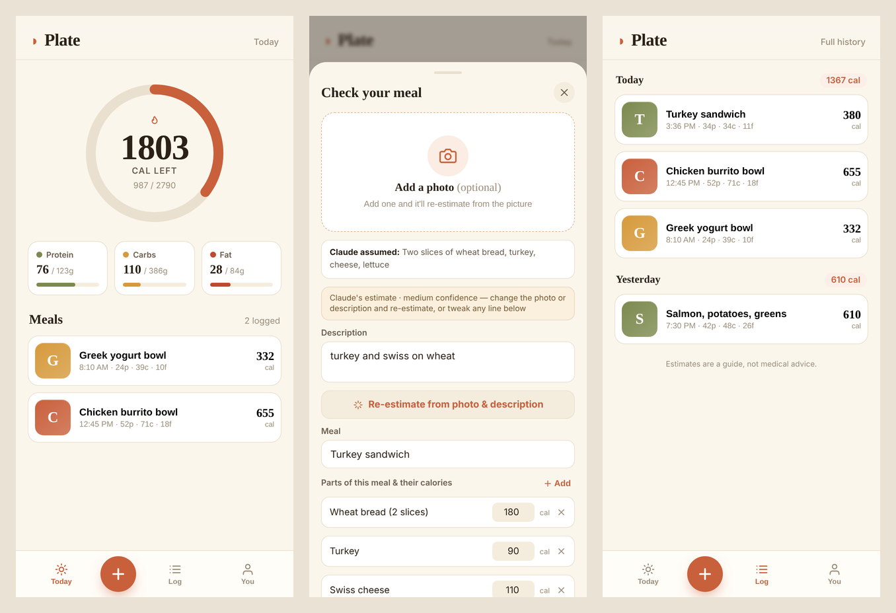

# Plate

**Snap a photo of a meal (or just describe it) and get an itemized calorie and macro estimate that syncs across your phone and computer.**

**Try it:** [plate-two-ruddy.vercel.app](https://plate-two-ruddy.vercel.app). Create an account to log meals and set goals. On this public copy, photo estimates are reserved for the owner, because each one costs API credits; deploy your own copy (below) to use them.



<sub>Screenshots show demo data.</sub>

## Features

- **Photo or text in, itemized estimate out.** Claude splits a meal into its components (the chicken, the rice, the dressing) with calories, protein, carbs, and fat for each. You can edit any line before saving.
- **Personal targets.** Daily calorie and macro goals from the Mifflin-St Jeor equation, based on your height, weight, age, activity, and goal.
- **Live sync across devices** through Supabase Realtime. Log on your phone and it shows up on your laptop.
- **Installable PWA.** Add it to your home screen on iPhone or Android.
- **Private by design.** Photos are used only for the estimate and never stored. Postgres Row Level Security means each account can only read its own rows. The Anthropic key lives only on the server.
- **Backup and restore** to a JSON file. Imports are validated and de-duplicated.

## Tech stack

React 18 + htm (no build step) · Supabase (Postgres, Auth, Realtime, RLS) · Vercel serverless function (Node) · Anthropic Claude API (vision) · Service worker + web manifest

## Security

- The estimate endpoint **requires a signed-in Supabase user** and refuses to run if it isn't configured, so nobody can spend your API credits anonymously.
- `ALLOWED_EMAILS` limits estimates (the part that costs money) to your own account(s). Others can still sign up and log meals by hand unless you turn sign-ups off (Step 6 below).
- Input is validated (image type, size, and description length), and upstream errors are logged server-side rather than returned to the browser.
- No wildcard CORS. Security headers (HSTS, nosniff, frame denial, permissions policy) are set in `vercel.json`.
- The Supabase **anon key** in `index.html` is designed to be public. Data access is enforced by the RLS policies in `schema.sql`.
- The database enforces size and range limits on every row (`schema.sql`). For a database created before these were added, run `schema_limits.sql` once.
- A per-user rate limit (default 30 estimates per 10 minutes, `ESTIMATES_PER_10_MIN`) stops runaway loops.

## Tests

```bash
node --test        # Node 18+; mocks Supabase and Anthropic, needs no keys
```

---

## Deploy your own

This is a real app you host yourself. Day-to-day it's effortless; the one-time
setup below takes about 20–30 minutes and uses two free services plus your own
Anthropic API key (a few cents of usage per day for personal use).

## What's in this folder

```
index.html              The whole app (no build step)
api/estimate.js         Tiny server function that holds your API key + runs estimates
schema.sql              Database tables to paste into Supabase (safe to re-run)
schema_limits.sql       Adds size limits to a database made before they existed
manifest.webmanifest    Makes it installable on your phone
sw.js  icon.svg         PWA support
vercel.json  .env.example
tests/                  API tests (node --test)
```

## Step 1 — Create the database (Supabase, free)

1. Go to https://supabase.com, sign up, and create a new project. Pick any
   name and a database password (you won't need the password again).
2. When it's ready, open **SQL Editor → New query**, paste the entire contents
   of `schema.sql`, and click **Run**. You should see "Success".
3. Open **Authentication → Sign In / Providers** and make sure **Email** is
   enabled. For the fastest start, turn **Confirm email** OFF (you can turn it
   back on later). If you leave it on, you'll get a confirmation email on signup.
4. Open **Project Settings → API** and copy two values:
   - **Project URL** (looks like `https://abcd1234.supabase.co`)
   - **anon public** key (a long string)

## Step 2 — Get an Anthropic API key

1. Go to https://console.anthropic.com → **API Keys → Create Key**, and copy it.
2. Add a little credit under **Billing** (a few dollars lasts a long time for
   personal use). Keep this key secret — it goes on the server only, never in
   `index.html`.

## Step 3 — Put your Supabase keys into the app

Open `index.html`, find the `CONFIG` block near the top of the `<script>`, and
paste in your two Supabase values:

```js
const CONFIG = {
  SUPABASE_URL: "https://abcd1234.supabase.co",
  SUPABASE_ANON_KEY: "eyJ...your anon key...",
  ESTIMATE_URL: "/api/estimate",
};
```

(The anon key is meant to be public — your data is still protected because the
database only lets each user read their own rows.)

## Step 4 — Deploy (Vercel, free)

The easiest path uses a GitHub repo:

1. Create a free account at https://github.com and a new **empty** repository.
2. Upload this whole folder to it (GitHub's web UI has **Add file → Upload
   files** — drag everything in, including the `api` folder).
3. Go to https://vercel.com, sign up with GitHub, click **Add New → Project**,
   and import that repository. Framework preset: **Other**. Click **Deploy**.
4. In the Vercel project, open **Settings → Environment Variables** and add:
   - `ANTHROPIC_API_KEY` = your Anthropic key
   - `SUPABASE_URL` = your Supabase Project URL
   - `SUPABASE_ANON_KEY` = your Supabase anon key
   - `ALLOWED_EMAILS` = the email(s) you'll sign in with, comma-separated
     (only these accounts can run estimates on your key)
   Then **Redeploy** (Deployments → ⋯ → Redeploy) so the keys take effect.

Vercel gives you a URL like `https://plate-xxxx.vercel.app`. That's your app.

> Prefer no GitHub? Install Node, run `npm i -g vercel`, then run `vercel` inside
> this folder and follow the prompts. Add the env vars with
> `vercel env add ANTHROPIC_API_KEY` (etc.), then `vercel --prod`.

## Step 5 — Use it on both devices

1. Open your Vercel URL on your **computer**, create an account, set your
   profile on the **You** tab, and log a meal.
2. Open the same URL on your **phone's** browser and sign in with the same
   email/password. Your log is already there, and new entries sync live.
3. Install it like a native app:
   - **iPhone (Safari):** Share → **Add to Home Screen**.
   - **Android (Chrome):** menu → **Install app** / **Add to Home screen**.

If you turned email confirmation ON in Step 1.3, also set
**Authentication → URL Configuration → Site URL** in Supabase to your Vercel URL
so the confirmation link returns to your app.

## Step 6 — Lock it down

Create your own account first, so nobody else can register your email.

Then choose who else can use it:

- **Let others try it (sign-ups on).** With `ALLOWED_EMAILS` set to your email,
  anyone can create an account and log meals by hand, and each person sees only
  their own data. Only you can run photo estimates, which are what cost money;
  anyone else who tries is told estimates aren't turned on for their account.
- **Just you (sign-ups off).** Go to Supabase → **Authentication → Sign In /
  Providers** and turn **Allow new users to sign up** OFF.

Either way, set `ALLOWED_EMAILS`. Without it, every account can spend your
Anthropic credits.

## Notes

- **Costs:** Supabase and Vercel free tiers are plenty for personal use. You
  only pay Anthropic per estimate — typically pennies a day.
- **Estimates:** the model breaks each meal into components with calories and
  macros; you can edit any line or add/remove parts before saving. Swap models
  with the `ESTIMATE_MODEL` env var (`claude-haiku-4-5-20251001` is cheaper).
- **Backups:** the **You** tab has Export/Import (a JSON file) if you ever want
  a copy or to move accounts.
- **Privacy/security:** the API key lives only on Vercel. The function
  requires a signed-in user (and, with `ALLOWED_EMAILS`, one of yours) before
  spending credits. See the Security section above.
- **Updating the app:** edit the files, push to GitHub (or re-run `vercel`),
  and it redeploys. Your data is in Supabase, so it's untouched by redeploys —
  no data loss, unlike the published-artifact approach.

## License

MIT. See [LICENSE](LICENSE).
